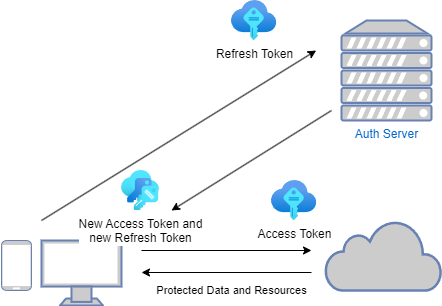
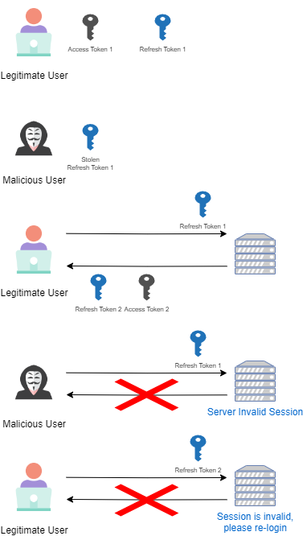

# AuthNGo

AuthNGo is a lightweight and efficient authentication and authorization service built with Go, utilizing JSON Web Tokens (JWT). Designed for simplicity and speed, AuthNGo allows users to quickly register, identify, and proceed with secure access to applications.

## Build & Deploy

To build and deploy the app, simply run the following commands:
```docker compose build```
```docker compose up -d```
The application listens on port 8080.
The build process also creates a PostgreSQL instance.

## DB Configuration

Create users table

```sql
CREATE TABLE users (
    id SERIAL PRIMARY KEY,
    email VARCHAR(255) NOT NULL UNIQUE,
    first_name VARCHAR(255) NOT NULL,
    last_name VARCHAR(255) NOT NULL,
    password VARCHAR(255) NOT NULL,
    created_at TIMESTAMP NOT NULL DEFAULT CURRENT_TIMESTAMP,
    updated_at TIMESTAMP NOT NULL DEFAULT CURRENT_TIMESTAMP
);
```

Create sessions table

```sql
CREATE TABLE sessions (
    id VARCHAR(255) PRIMARY KEY,
    email VARCHAR(255) NOT NULL,
    version INT NOT NULL
);
```

## Access Token and Refresh Token

Upon login, the user receives an access token and a refresh token. The access token has a short expiration time, while the refresh token has a longer expiration time.
With the access token, the user can access protected resources. The refresh token allows the user to obtain a new version of the access token when the old one has expired or is about to expire.

### Refresh Token Rotation

For security reasons, when the refresh token is used to refresh the access token, a new version of the refresh token is also returned to the client.



The session and the version of the refresh token are saved in a database for tracking and validation purposes. This way, a session can be invalidated by invalidating the refresh token. After the refresh token is invalidated, the session will last only as long as the access token, which is shorter and thus better for security.
This approach also has the advantage of faster access token validation (no database check needed), and services using this token do not need to access the database or layers within this service, making the services independent of each other.

### Refresh Token Compromise Detection

When a malicious user manages to obtain the refresh token of a legitimate user, the scenario described in the image below occurs:



In summary, when a refresh token request with an incorrect version is received, the session is invalidated, and neither the malicious user nor the legitimate user can refresh the token. The user will need to log in again, starting a new session.

## API

Le api create sono le seguenti:

### Registration

POST /registration

input

```json
{
    "email": "catania.alessio96@gmail.com",
    "password": "12345rf6",
    "firstName": "alessio",
    "lastName": "catania"
}
```

output

```json
{
    "error": false,
    "message": "Logged in user 12",
    "data": {
        "firstname": "alessio",
        "lastname": "catania",
        "email": "catania.alessio96@gmail.com"
    }
}
```

### Login

POST /login

input

```json
{
    "email": "catania.alessio96@gmail.com",
    "password": "12345rf6"
}
```

### Refresh Token

POST /refresh-token

Cookies: RefreshToken

### User Data

GET /user-data

Cookies: AccessToken
